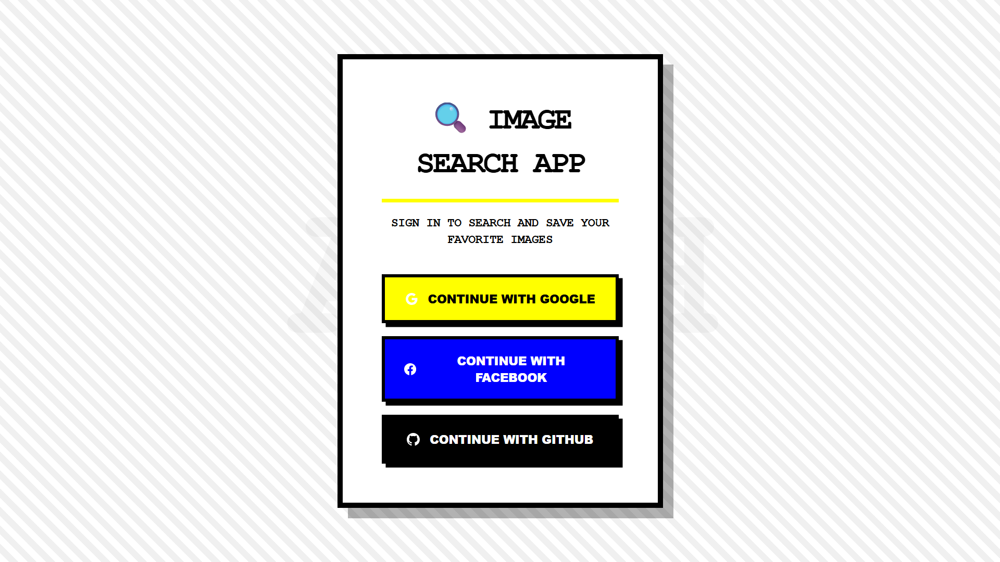
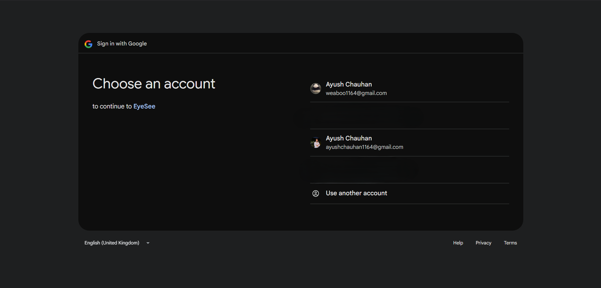
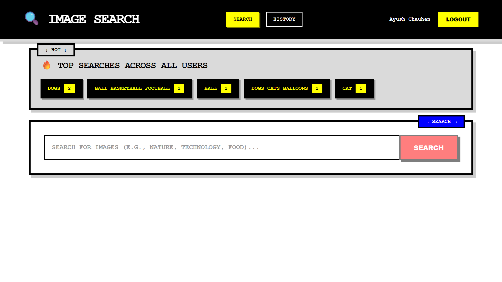

# 🔍 MERN Image Search with OAuth

A full-stack MERN (MongoDB, Express.js, React.js, Node.js) application featuring OAuth authentication and image search functionality powered by the Unsplash API.


## ✨ Features

- 🔐 **OAuth Authentication** - Login with Google, Facebook, or GitHub using Passport.js
- 🔍 **Image Search** - Search images from Unsplash API
- ✅ **Multi-Select** - Select multiple images with checkbox overlay in a 4-column grid
- 📊 **Top Searches** - Banner displaying top 5 most searched terms across all users
- 📜 **Search History** - Personal search history with timestamps for each user
- 💾 **Data Persistence** - All searches stored in MongoDB

## 🏗️ Project Structure

```
New_internship/
├── client/                 # React frontend
│   ├── public/
│   │   └── index.html
│   ├── src/
│   │   ├── components/
│   │   │   ├── Login.js           # OAuth login page
│   │   │   ├── Header.js          # App header with user info
│   │   │   ├── TopSearchesBanner.js  # Top searches display
│   │   │   ├── SearchBar.js       # Search input component
│   │   │   ├── ImageGrid.js       # 4-column image grid with multi-select
│   │   │   └── SearchHistory.js   # User's search history
│   │   ├── App.js            # Main application component
│   │   ├── index.js          # React entry point
│   │   └── index.css         # Global styles
│   └── package.json
│
├── server/                # Express backend
│   ├── config/
│   │   └── passport.js       # Passport OAuth configuration
│   ├── models/
│   │   ├── User.js           # User model
│   │   └── Search.js         # Search history model
│   ├── routes/
│   │   ├── auth.js           # OAuth routes
│   │   ├── search.js         # POST /api/search
│   │   ├── history.js        # GET /api/history
│   │   └── topSearches.js    # GET /api/top-searches
│   ├── middleware/
│   │   └── auth.js           # Authentication middleware
│   ├── server.js             # Express server
│   ├── package.json
│   └── .env.example          # Environment variables template
│
├── .gitignore
└── README.md
```

## 🚀 Setup Instructions

### Prerequisites

- Node.js (v14 or higher)
- MongoDB (local or Atlas)
- Unsplash API Account
- OAuth Apps (Google, Facebook, GitHub)

### Step 1: Clone the Repository

```bash
cd "c:\Users\91819\Desktop\Tor Browser\New_internship"
```

### Step 2: Set Up Backend

```bash
cd server
npm install
```

Create a `.env` file in the `server` directory:

```env
# MongoDB Connection
MONGODB_URI=mongodb://localhost:27017/image-search-app

# Server Configuration
PORT=5000
SESSION_SECRET=your_random_session_secret_here_use_complex_string

# Client URL (for CORS)
CLIENT_URL=http://localhost:3000

# Unsplash API
UNSPLASH_ACCESS_KEY=your_unsplash_access_key_here

# Google OAuth
GOOGLE_CLIENT_ID=your_google_client_id_here
GOOGLE_CLIENT_SECRET=your_google_client_secret_here
GOOGLE_CALLBACK_URL=http://localhost:5000/auth/google/callback

# Facebook OAuth
FACEBOOK_APP_ID=your_facebook_app_id_here
FACEBOOK_APP_SECRET=your_facebook_app_secret_here
FACEBOOK_CALLBACK_URL=http://localhost:5000/auth/facebook/callback

# GitHub OAuth
GITHUB_CLIENT_ID=your_github_client_id_here
GITHUB_CLIENT_SECRET=your_github_client_secret_here
GITHUB_CALLBACK_URL=http://localhost:5000/auth/github/callback
```

### Step 3: Set Up Frontend

```bash
cd ../client
npm install
```

### Step 4: Obtain API Keys

#### Unsplash API

1. Go to [https://unsplash.com/developers](https://unsplash.com/developers)
2. Create a new application
3. **Note:** Unsplash requires proper photo attribution (already implemented in this app!)
4. Copy the **Access Key** to `UNSPLASH_ACCESS_KEY`

#### Google OAuth

1. Go to [Google Cloud Console](https://console.cloud.google.com/)
2. Create a new project or select existing
3. Enable "Google+ API"
4. Go to Credentials → Create OAuth 2.0 Client ID
5. Set Authorized redirect URI: `http://localhost:5000/auth/google/callback`
6. Copy Client ID and Secret to `.env`

#### Facebook OAuth

1. Go to [Facebook Developers](https://developers.facebook.com/)
2. Create a new app
3. Add "Facebook Login" product
4. Set Valid OAuth Redirect URI: `http://localhost:5000/auth/facebook/callback`
5. Copy App ID and Secret to `.env`

#### GitHub OAuth

1. Go to [GitHub Settings → Developer Settings](https://github.com/settings/developers)
2. New OAuth App
3. Set Authorization callback URL: `http://localhost:5000/auth/github/callback`
4. Copy Client ID and Secret to `.env`

### Step 5: Set Up Database

#### Option A: MongoDB Atlas (Cloud - Recommended)

1. Go to [MongoDB Atlas](https://www.mongodb.com/cloud/atlas)
2. Create a free account and cluster
3. Get your connection string
4. Add to `.env`: `MONGODB_URI=mongodb+srv://...`

#### Option B: Local MongoDB

```bash
mongod
```

### Step 6: Run the Application

**Terminal 1 - Backend:**

```bash
cd server
npm run dev
# Server runs on http://localhost:5000
```

**Terminal 2 - Frontend:**

```bash
cd client
npm start
# Client runs on http://localhost:3000
```

## 📡 API Endpoints

### Authentication Endpoints

#### Login with OAuth Provider

```bash
GET /auth/google
GET /auth/facebook
GET /auth/github
```

**Description:** Initiates OAuth flow for the specified provider

**Response:** Redirects to provider's login page

---

#### OAuth Callback

```bash
GET /auth/google/callback
GET /auth/facebook/callback
GET /auth/github/callback
```

**Description:** OAuth callback handler

**Response:** Redirects to client application

---

#### Get Current User

```bash
GET /auth/user
```

**Description:** Returns currently authenticated user

**Response:**

```json
{
  "user": {
    "id": "507f1f77bcf86cd799439011",
    "displayName": "John Doe",
    "email": "john@example.com",
    "avatar": "https://example.com/avatar.jpg",
    "provider": "google"
  }
}
```

**cURL Example:**

```bash
curl -X GET http://localhost:5000/auth/user \
  --cookie-jar cookies.txt \
  --cookie cookies.txt
```

---

#### Logout

```bash
GET /auth/logout
```

**Description:** Logs out the current user

**Response:**

```json
{
  "message": "Logged out successfully"
}
```

**cURL Example:**

```bash
curl -X GET http://localhost:5000/auth/logout \
  --cookie cookies.txt
```

---

### Search Endpoints

#### Search Images

```bash
POST /api/search
```

**Description:** Search for images using Unsplash API and save to history

**Authentication:** Required

**Request Body:**

```json
{
  "term": "nature"
}
```

**Response:**

```json
{
  "term": "nature",
  "count": 30,
  "images": [
    {
      "id": "abc123",
      "url": "https://images.unsplash.com/photo-...",
      "thumb": "https://images.unsplash.com/photo-...?w=400",
      "description": "Beautiful nature landscape",
      "photographer": "Jane Smith",
      "photographerUrl": "https://unsplash.com/@janesmith"
    }
  ]
}
```

**cURL Example:**

```bash
curl -X POST http://localhost:5000/api/search \
  -H "Content-Type: application/json" \
  -d '{"term":"nature"}' \
  --cookie cookies.txt
```

---

#### Get Top Searches

```bash
GET /api/top-searches
```

**Description:** Get top 5 most searched terms across all users

**Authentication:** Not required

**Response:**

```json
{
  "topSearches": [
    {
      "term": "nature",
      "count": 45
    },
    {
      "term": "technology",
      "count": 32
    },
    {
      "term": "food",
      "count": 28
    }
  ]
}
```

**cURL Example:**

```bash
curl -X GET http://localhost:5000/api/top-searches
```

---

#### Get Search History

```bash
GET /api/history
```

**Description:** Get current user's search history (last 20 searches)

**Authentication:** Required

**Response:**

```json
{
  "history": [
    {
      "term": "nature",
      "timestamp": "2025-11-03T10:30:00.000Z"
    },
    {
      "term": "technology",
      "timestamp": "2025-11-03T09:15:00.000Z"
    }
  ]
}
```

**cURL Example:**

```bash
curl -X GET http://localhost:5000/api/history \
  --cookie cookies.txt
```

---

## 🗄️ Database Schema

### User Model

```javascript
{
  provider: String,        // 'google' | 'facebook' | 'github'
  providerId: String,      // OAuth provider's user ID
  displayName: String,     // User's display name
  email: String,           // User's email (optional)
  avatar: String,          // Profile picture URL
  createdAt: Date          // Account creation date
}
```

### Search Model

```javascript
{
  userId: ObjectId,        // Reference to User
  term: String,            // Search term
  timestamp: Date          // When the search was performed
}
```

## 🎨 Frontend Features

### Login Page

- Three OAuth login buttons (Google, Facebook, GitHub)
- Responsive design with gradient background
- SVG icons for each provider

### Main Application

- **Header**: User info with avatar and logout button
- **Top Searches Banner**: Displays top 5 searches with count badges
- **Search Bar**: Input with search button
- **Image Grid**: 4-column responsive grid
  - Checkbox overlay on each image
  - Multi-select functionality
  - Selected counter above grid
- **Search History**: List of past searches with relative timestamps

## 📸 Screenshots

### OAuth Login


_Three OAuth providers with modern UI_

### OAuth Authentication Flow


_Complete OAuth authentication process_

### Top Searches Banner


_Shows most popular search terms_

### Search Bar


_Search input with brutalist design_

<!-- ### Search Results with Multi-Select


_4-column grid with checkbox overlay_ -->

### Multi-Select Interaction


_Interactive checkbox selection_

<!-- ### Image Grid Layout


_4-column responsive grid layout_ -->

### Search History


_Personal search history with timestamps_

<!-- ### Complete Application View


_Full application interface_

### Mobile Responsive Design


_Responsive mobile layout_

### User Profile Header


_User profile with avatar and logout_ -->

## 🔧 Technologies Used

### Backend

- **Express.js** - Web framework
- **MongoDB** - Database
- **Mongoose** - ODM
- **Passport.js** - OAuth authentication
- **express-session** - Session management
- **axios** - HTTP client for Unsplash API
- **cors** - Cross-origin resource sharing
- **dotenv** - Environment variables

### Frontend

- **React.js** - UI library
- **axios** - HTTP client
- **CSS3** - Styling with Grid and Flexbox

## 🛠️ Development

### Running in Development Mode

Backend with auto-restart:

```bash
cd server
npm run dev
```

Frontend with hot reload:

```bash
cd client
npm start
```

### Building for Production

```bash
cd client
npm run build
```

## 🐛 Troubleshooting

### MongoDB Connection Error

- Ensure MongoDB is running: `mongod`
- Check connection string in `.env`

### OAuth Redirect Issues

- Verify callback URLs match in OAuth app settings
- Check that `CLIENT_URL` is correct in `.env`

### Unsplash API Rate Limit

- Free tier: 50 requests/hour
- Upgrade for higher limits if needed

### CORS Errors

- Ensure `CLIENT_URL` in backend `.env` matches frontend URL
- Check `axios.defaults.withCredentials = true` is set

## 📝 License

MIT License - feel free to use this project for learning or commercial purposes.

## 👨‍💻 Author

Created as part of a MERN stack internship project.

## 🤝 Contributing

Contributions, issues, and feature requests are welcome!

---

**Note:** Remember to never commit your `.env` file. Always use `.env.example` as a template.
